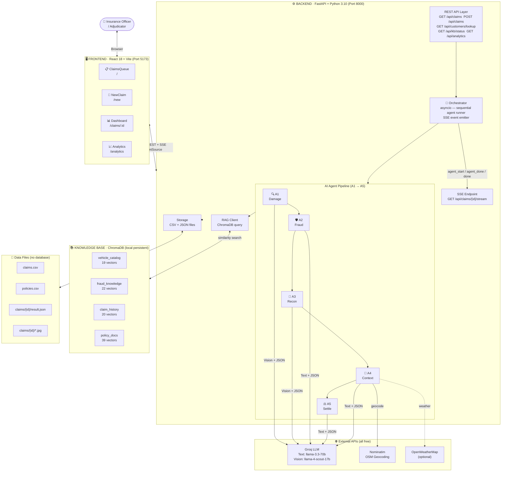
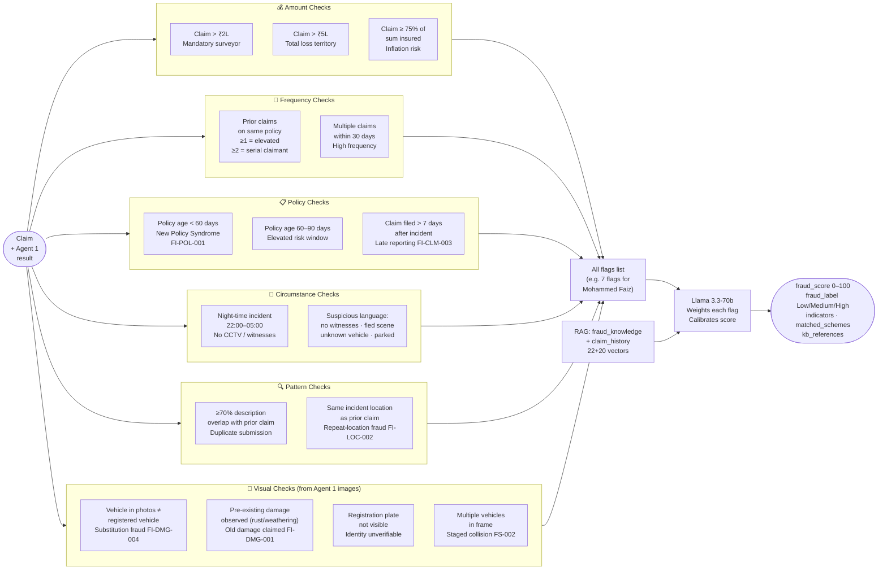
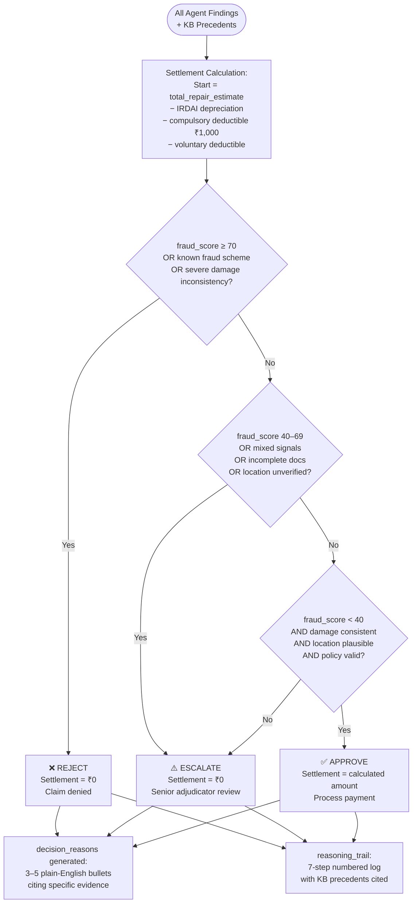
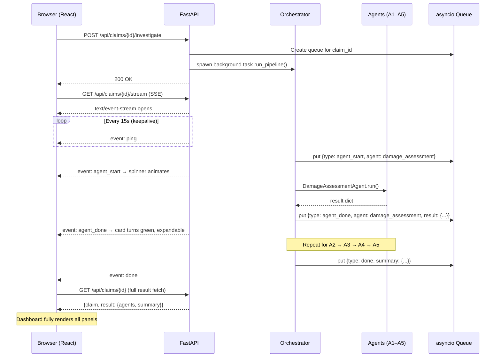
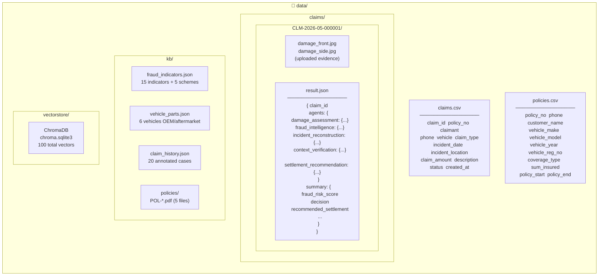
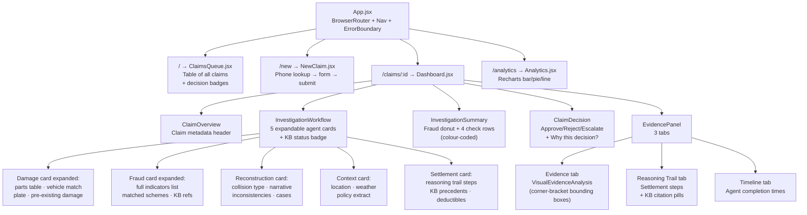

# ClaimIntel — Architecture & End-to-End Flow
_Last updated: 2026-05-25_

---

## 1. System Architecture

---

## 2. End-to-End Claim Processing Flow

```mermaid
flowchart TD
    START(["🏠 Customer Opens ClaimIntel"])

    subgraph SUBMIT["  Step 1 — Claim Submission  (NewClaim page)  "]
        PHONE["Enter phone number\ne.g. 9988776655"]
        LOOKUP["GET /api/customers/lookup?phone=...\nReturns policy details from policies.csv"]
        PREFILL["PolicyCard auto-fills:\nName · Vehicle · Policy No. · Coverage"]
        FORM["Fill incident form:\nType · Date · Location · Description"]
        PHOTOS["Upload damage photos\n(1–4 images)"]
        POST["POST /api/claims/\nReturns claim_id: CLM-2026-05-XXXXXX"]
    end

    subgraph STORAGE["  Step 2 — Storage  "]
        CSV_ROW["New row → claims.csv\nstatus=Pending  amount=0"]
        DIR["New directory created:\ndata/claims/CLM-2026-05-XXXXXX/"]
        IMGS["Images saved to claim directory"]
    end

    subgraph PIPELINE["  Step 3 — AI Investigation Pipeline  "]
        TRIG["POST /api/claims/{id}/investigate\n→ Background asyncio task spawned"]
        SSE_OPEN["GET /api/claims/{id}/stream\n→ EventSource opens (browser listens)"]

        subgraph A1BOX["Agent 1 — Damage Assessment"]
            A1IN["Input: images + vehicle + description"]
            A1KB["RAG: vehicle_catalog (OEM pricing)"]
            A1LLM["Vision LLM: Llama 4 Scout\nAnalyses images"]
            A1OUT["Output:\ndamaged_parts + severities + estimates\nvehicle_match · plate · pre_existing_damage"]
        end

        subgraph A2BOX["Agent 2 — Fraud Intelligence"]
            A2R["16 Rule-Based Checks\n(see Diagram 3)"]
            A2KB["RAG: fraud_knowledge + claim_history"]
            A2LLM["Text LLM: Llama 3.3-70b\nScores all signals"]
            A2OUT["Output:\nfraud_score (0–100) · fraud_label\nindicators · matched_schemes"]
        end

        subgraph A3BOX["Agent 3 — Incident Reconstruction"]
            A3IN["Input: images + damage_map + description"]
            A3KB["RAG: claim_history (similar cases)"]
            A3LLM["Vision LLM: Llama 4 Scout"]
            A3OUT["Output:\ncollision_type · story_match · confidence\nstoryboard_panels · inconsistencies"]
        end

        subgraph A4BOX["Agent 4 — Context Verification"]
            A4GEO["Nominatim geocoding\n+ OpenWeatherMap"]
            A4KB["RAG: policy_documents"]
            A4OUT["Output:\nlocation_verified · weather\npolicy_coverage_note"]
        end

        subgraph A5BOX["Agent 5 — Settlement Recommendation"]
            A5KB["RAG: all 4 collections"]
            A5LLM["Text LLM: Llama 3.3-70b\nIRDAI decision rules"]
            A5OUT["Output:\nApprove / Reject / Escalate\nrecommended_settlement\ndecision_reasons · reasoning_trail"]
        end

        SUMMARY["Orchestrator derives summary:\nfraud_risk · damage_consistency\nincident_consistency · external_verification\nbehavioural_analysis"]
        SAVE["result.json saved\nstatus → Completed in claims.csv"]
    end

    subgraph DISPLAY["  Step 4 — Dashboard Renders  "]
        SSE_DONE["SSE done event\n→ fetch full result"]
        CARDS["Live panels update:\nInvestigationWorkflow (expandable cards)\nInvestigationSummary (fraud donut)\nClaimDecision (Why this decision?)\nEvidencePanel (bounding boxes)"]
    end

    START --> PHONE --> LOOKUP --> PREFILL --> FORM --> PHOTOS --> POST
    POST --> CSV_ROW --> DIR --> IMGS
    IMGS --> TRIG
    TRIG --> SSE_OPEN
    TRIG --> A1IN --> A1KB --> A1LLM --> A1OUT
    A1OUT --> A2R --> A2KB --> A2LLM --> A2OUT
    A2OUT --> A3IN --> A3KB --> A3LLM --> A3OUT
    A3OUT --> A4GEO --> A4KB --> A4OUT
    A4OUT --> A5KB --> A5LLM --> A5OUT
    A5OUT --> SUMMARY --> SAVE
    SAVE --> SSE_DONE --> CARDS
    SSE_OPEN -.->|"real-time events\nagent_start / agent_done"| CARDS
```

---

## 3. Fraud Intelligence — 16 Checks

---

## 4. IRDAI Decision Logic (Agent 5)

---

## 5. Real-Time SSE Streaming Architecture

---

## 6. Data Storage Layout

---

## 7. Frontend Component Tree

---

## Summary — Technology Stack

| Layer | Technology | Purpose |
|---|---|---|
| **Frontend** | React 18 + Vite + Tailwind CSS | UI |
| **Charts** | Recharts | Analytics page |
| **Streaming** | SSE (`EventSource`) | Live agent updates |
| **Backend** | FastAPI + Python 3.10 + uvicorn | API + orchestration |
| **LLM (text)** | Groq `llama-3.3-70b-versatile` | Agents 2, 4, 5 |
| **LLM (vision)** | Groq `llama-4-scout-17b-16e` | Agents 1, 3 (image analysis) |
| **Embeddings** | ChromaDB `DefaultEmbeddingFunction` | ONNX local, offline |
| **Vector DB** | ChromaDB (local persistent) | KB similarity search |
| **Geocoding** | Nominatim / OpenStreetMap | Agent 4 location verification |
| **Weather** | OpenWeatherMap | Agent 4 (optional) |
| **PDF gen** | fpdf2 | Policy document generation |
| **PDF parse** | PyMuPDF (fitz) | Vectorstore building |
| **Storage** | CSV files + JSON files | No database needed |
| **Fraud Rules** | Custom Python (16 checks) | Pre-LLM flag generation |

---

## Fraud Detection Coverage (16 Checks)

| # | Check | Source | Flag ID |
|---|---|---|---|
| 1 | Claim amount > ₹2L | Rule | IRDAI |
| 2 | Claim amount > ₹5L | Rule | IRDAI |
| 3 | Prior claims count (≥1, ≥2) | Rule | FI-CLM-001 |
| 4 | Multiple claims within 30 days | Rule | FI-CLM-002 |
| 5 | Policy age < 60 days | Rule | FI-POL-001 |
| 6 | Policy age 60–90 days | Rule | — |
| 7 | Late reporting (> 7 days) | Rule | FI-CLM-003 |
| 8 | Night-time incident (22:00–05:00) | Rule | — |
| 9 | Suspicious language in description | NLP | FI-LOC-001 / FI-BEH-001 |
| 10 | Same location as prior claim | Rule | FI-LOC-002 |
| 11 | Near-duplicate description (≥70% match) | NLP | — |
| 12 | Claim ≥ 75% of sum insured | Rule | — |
| 13 | Vehicle in photos ≠ registered vehicle | Vision (A1) | FI-DMG-004 |
| 14 | Pre-existing damage observed in photos | Vision (A1) | FI-DMG-001 |
| 15 | Registration plate not visible | Vision (A1) | FI-DMG-003 |
| 16 | Multiple vehicles in frame | Vision (A1) | FS-002 |
